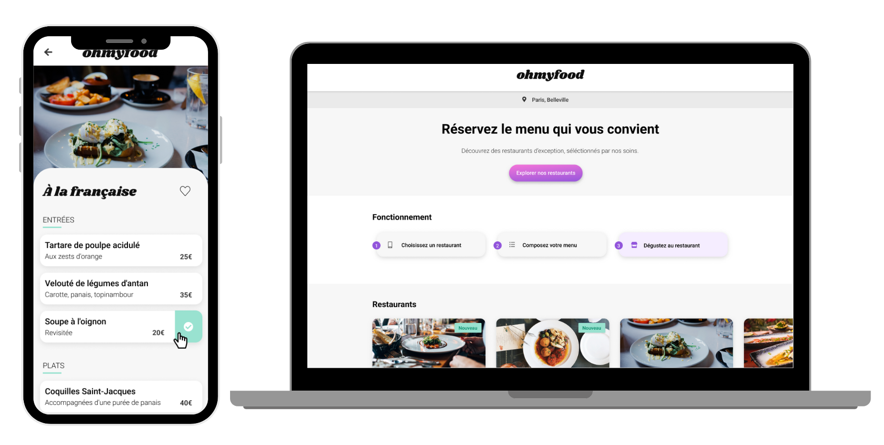

# ohmyfood 📱🍴

## Description :

Projet réalisé dans le cadre du programme de formation Développeur d'application JavaScript & React chez [OpenClassrooms](https://openclassrooms.com/fr/paths/877-developpeur-dapplication-javascript-react)

### Objectif :

> Développer un site “mobile first” qui répertorie les menus de restaurants gastronomiques.
>
> #### Technologies :
>
> - Le développement doit se faire en CSS, sans JavaScript
> - Le site devra être réalisé en adoptant le Mobile First, c’est-à-dire qu’il faudra d’abord réaliser l'intégration de la maquette mobile, puis tablette, et enfin l'intégration du responsive vers le desktop
> - Tout le code doit être versionné sur GitHub avec des commits réguliers
> - Le site devra être accessible sur GitHub Pages une fois terminé.

### Mon rôle :

Développeur junior pour une jeune startup qui voudrait s'imposer sur le marché de la restauration.

L’objectif est de réaliser un site “mobile first” qui répertorie les menus de restaurants gastronomiques. En plus des systèmes classiques de réservation, les clients pourront composer le menu de leur repas pour que les plats soient prêts à leur arrivée.

Mon rôle a été de réaliser le site en intégrant les maquettes mobile First, c'est-à-dire que le CSS principal nous servira pour le mobile, et que les media queries nous permettront d’aller vers le format desktop.  
L'intégration devra se faire en HTML et CSS afin de rendre le site dynamique avec diverses animations soignées.

[Voir les maquettes](#maquettes-)

### Cahier des charges :

#### Contraintes techniques :

- Respecter les maquettes mobiles et réaliser le site en utilisant une approche Mobile first puis tablette, et enn l'intégration du responsive vers le desktop.
- Identité graphique :
  - Primaire :  `#9356dc`
  - Secondaire :  `#ff79da`
  - Tertiaire :  `#99e2d0`
  - Police : _[Shrikhand](https://fonts.google.com/specimen/Shrikhand)_ pour le logo et les titres et _[Roboto](https://fonts.google.com/specimen/Roboto)_ pour le texte.

#### Fonctionnement :

- Aucun framework ne devra être utilisé ; en revanche l’utilisation de SASS serait un plus.
- Aucun code CSS ne doit être appliqué via un attribut style dans une balise HTML.

#### Compatibilité :

- Les pages devront passer la validation W3C en HTML et CSS sans erreur.
- Le site doit être compatible avec les dernières versions de Chrome, Firefox et Firefox.

#### Livrables attendus :

#### Contenu des pages :

- **Page d’accueil (x1) :**

  - Achage de la localisation des restaurants.
  - Une section contenant les 4 menus sous forme de cartes. Au clic sur la carte, l’utilisateur est redirigé vers la page du menu.

- **Pages de menu (x4) :**

  - 4 pages contenant chacune le menu d’un restaurant.

- **Footer :**

  - Le footer est identique sur toutes les pages.
  - Au clic sur “Contact”, un renvoi vers une adresse mail est effectué.

- **Header :**
  - Le header est présent sur toutes les pages.
  - Sur la page d’accueil, il contient le logo du site.
  - Sur les pages de menu, il contient en plus un bouton de retour vers la page d’accueil.

#### Effets graphiques et animations :

- **Boutons :**

  - Au survol, la couleur de fond des boutons principaux devra légèrement s’éclaircir. L’ombre portée devra également être plus visible.
  - un bouton "J’aime" en forme de cœur est présent sur la maquette, Au survol, il devra se remplir progressivement.

- **Page d’accueil :**

  - un “loader” est nécessaire. Il devra apparaître pendant 1 à 3 secondes quand on arrive sur la page d'accueil, couvrir l'intégralité de l'écran, et utiliser les animations CSS (pas de librairie).

- **Pages de menu :**
  - À l’arrivée sur la page, les plats devront apparaître progressivement avec un léger décalage dans le temps.
  - Le visiteur peut ajouter les plats qu'il souhaite à sa commande en cliquant dessus. Cela fait apparaître une petite coche à droite du plat. Cette coche devra coulisser de la droite vers la gauche.

## Ressources utilisées: :

- [Visual Studio Code](https://code.visualstudio.com/) - Editeur de codes
- [Sass](https://sass-lang.com/) - Préprocesseur CSS
- [Font Awesome](https://fontawesome.com/) - Bibliothèque d'icône
- [Google Font](https://fonts.google.com/) - Bibliothèque de polices
- [GitHub](https://github.com/) - Outil de Contrôle de versions
- [GitHub Pages](https://pages.github.com/) - Outil d’hébergement d'un site web
- [Validateur W3C](https://validator.w3.org/) - Outil pour vérifier que le code est conforme aux standards du Web.

Venez visiter mon site [OhMyFood] https://github.com/imane33941/OhMyFood

## Maquettes :

Accueil :

  

Page menu :

  

---
